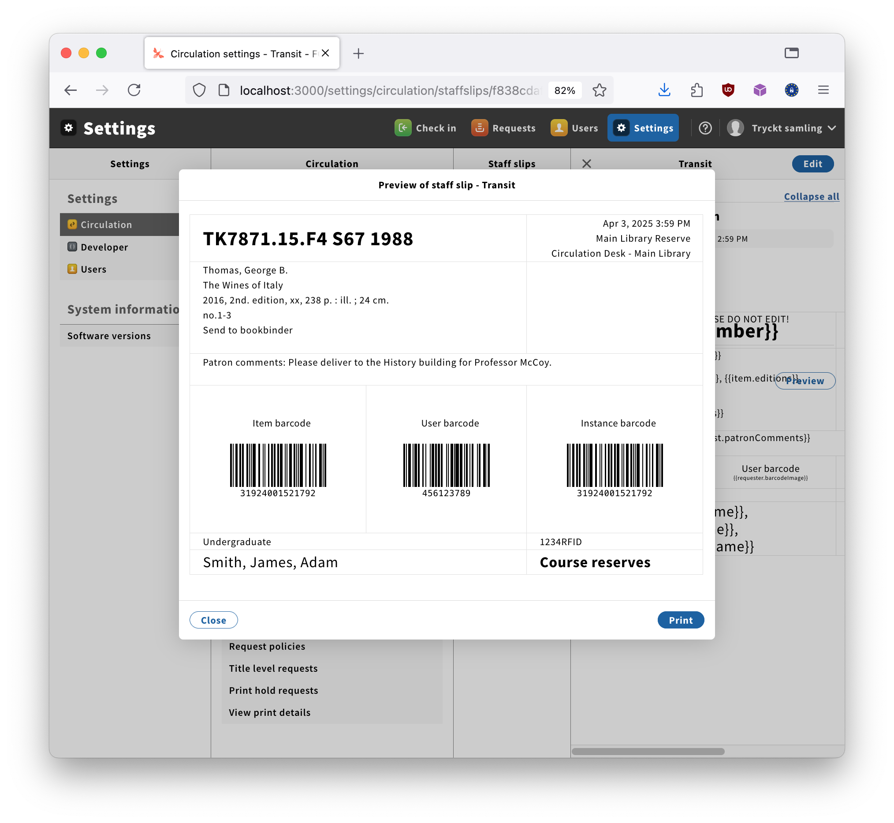

# Allowing HTML in staff-slip templates

<!-- md2toc -l 2 allow-html.md -->
* [Goal](#goal)
* [Current implementation](#current-implementation)
    * [Fetching staff-slips](#fetching-staff-slips)
    * [Editing staff-slips](#editing-staff-slips)
* [Proposal](#proposal)
* [Prototype](#prototype)
    * [Prototype approach](#prototype-approach)
    * [Prototype results](#prototype-results)
* [Conclusion](#conclusion)


## Goal

At present, a staff-slip that contains (for example):
```
This is in <b>bold</b> face.
```
is rendered as

> This is in &lt;b&gt;bold&lt;/b&gt; face.

rather than

> This is in <b>bold</b> face.

A possible lightweight approach to providing more flexibility in formatting staff slips (for staff-slip editors who are sufficiently hardcore) would be to optionally allow HTML elements to be interpreted as HTML rather than escaped.

This would allow not only simple inline formatting like `<i>` and `<b>`, but also structural markup such as `<table>`/`<tr>`/`<td>`.


## Current implementation


### Fetching staff-slips

By the time staff-slips are fetched from the back-end -- for example, at http://localhost:3000/settings/circulation/staffslips -- they have already had HTML escaping done to them, and those HTML tags that are _not_ already escaped seem to be used as-is. For example:
```
GET http://localhost:3010/staff-slips-storage/staff-slips

{
  "staffSlips": [
    {
      "id": "f838cdaf-555a-473f-abf1-f35ef6ab8ae1",
      "name": "Transit",
      "description": "Mike is working on this: please do not edit",
      "active": true,
      "template": "<div>{{item.title}} / {{item.primaryContributor}}</div><div>Item loan trype: {{item.loanType}}</div><div><br></div><div><strong>NEW TOKENS:</strong></div><div>Item accession number: {{item.accessionNumber}}</div><div>Item administrative notes: {{item.administrativeNotes}}</div><div><br></div><div>Year of publication: {{item.datesOfPublication}}</div><div>Editions: {{item.editions}}</div><div>Physical description: {{item.physicalDescriptions}}</div><div><br></div><div>Instance HRID: {{item.instanceHrid}}</div><div>Instance HRID barcode: {{item.instanceHridImage}}</div><div>&lt;small&gt;Instance HRID barcode: {{item.instanceHridImage}}&lt;/small&gt;</div>",
      "metadata": {
        "createdDate": "2025-03-18T19:37:13.674+00:00",
        "createdByUserId": "512804cf-ec3d-4644-bee3-cd2033fbe87e",
        "updatedDate": "2025-03-18T19:37:13.674+00:00",
        "updatedByUserId": "512804cf-ec3d-4644-bee3-cd2033fbe87e"
      }
    }
  ],
  "totalRecords": 1
}
```
(Note that the "NEW TOKENS" heading is bolded by the use of `<strong>...</strong>` but that the `<small>...</small>` entered manually to enclose the last token appears as `&lt;small&gt;...&lt;/small&gt;`.)

This shows that if we can save the slip with the angle-brackets intact, we should be able to see them interpreted in the printable slips.


### Editing staff-slips

When editing a staff-slip and adding a sequence such as
```
This is <tt>typewriter</tt> font.
```
the slip is PUT to http://localhost:3010/staff-slips-storage/staff-slips/f838cdaf-555a-473f-abf1-f35ef6ab8ae1 and the PUT data is:
```
{
  "id": "f838cdaf-555a-473f-abf1-f35ef6ab8ae1",
  "name": "Transit",
  "description": "Mike is working on this: please do not edit",
  "active": true,
  "template": "<div>{{item.title}} / {{item.primaryContributor}}</div><div>Item loan trype: {{item.loanType}}</div><div><br></div><div><strong>NEW TOKENS:</strong></div><div>Item accession number: {{item.accessionNumber}}</div><div>Item administrative notes: {{item.administrativeNotes}}</div><div><br></div><div>Year of publication: {{item.datesOfPublication}}</div><div>Editions: {{item.editions}}</div><div>Physical description: {{item.physicalDescriptions}}</div><div><br></div><div>Instance HRID: {{item.instanceHrid}}</div><div>Instance HRID barcode: {{item.instanceHridImage}}</div><div>&lt;small&gt;Instance HRID barcode: {{item.instanceHridImage}}&lt;/small&gt;</div><div>This is &lt;tt&gt;typewriter&lt;/tt&gt; font.</div>",
  "metadata": {
    "createdDate": "2025-03-18T19:37:13.674+00:00",
    "createdByUserId": "512804cf-ec3d-4644-bee3-cd2033fbe87e",
    "updatedDate": "2025-03-18T19:37:13.674+00:00",
    "updatedByUserId": "512804cf-ec3d-4644-bee3-cd2033fbe87e"
  }
}
```
Note that the version of the template sent to storage has _already_ had the angle brackets escaped. This is very exciting, as it suggests that all the work is happening in the UI -- no quoting is being done on the back-end.


## Proposal

We could extend the template object -- which currently has a title and the template itself -- with a boolean field (shown as a checkbox in the **Circulation** &rarr; **Settings** &rarr; **Staff slips** UI) indicating whether the template should be interpreted as HTML. This would default to false, so that the present behaviour would remain the default.

It is possible, but not certain, that this would give us enough flexibility to format the staff slips in the way we need. At the least, access to HTML tables would allow some layout beyond just sequencing.


## Prototype

### Prototype approach

Rather than try to modify the `stripes-template-editor` library, which controls how temlates are edited and what data is supplied back to the setting page to submission to the FOLIO back-end, I decided to take a simpler approach: modify the way that forms are interpreted when they are displayed, so that escaped angle brackets `&lt;` and `&gt;` are translated back into `<` and `>`. My idea was that then it would be possible to add HTML tags to the templates, they would be saved like the `&lt;b&gt;` tags mentioned above, and we could display how the forms _would_ look had they been saved without the escaping of special characters.

(I now think this approach was a mistake, for reasons that will become apparent.)

### Prototype results

First, the good news: Here is what I currently have displaying:



Superfically, this looks good, and a pretty good match for [the Aleph slip that I'm using as a model](../examples/Aleph_FOLIO_circulation.jpg). However:

* It is not possible to supply a CSS stylesheet as part of the content, so all styling has to be done inline. As a result [the HTML for this template](../examples/mockup.html) is extremely ugly and rather awkward to maintain.
* The formatted slip begins with about 500 pixels of vertical whitespace, which I have not been able to suppress. Instead, I have set the HTML `<table>`'s `margin-top` to -500 pixels, as the only way to get the slip to appear at the top of the table rather than half way down. As a result, when viewing the [the template](../examples/mockup.html) in a browser it appears empty, as all the content is above to the top of the window.
* I have not been able to find a way to force the column widths to be in 1:1:1 ratio. In the screenshot, they work out that was because all the barcodes are the same width; but when the instance HRID barcode is used in the right column, as it ought to be, the column grows wider and overflows the table. (This happens even if the barcode is force-scaled down to 10% of its true size.)
* Newline characters in the template are interpreted as line-breaks rather than being insignificant as in true HTML. As a result, I had to move the `</td>` closing tags up onto the lines of the data that they enclose, to avoid having blank lines at the end of each cell.

More significantly, once an HTML template has been pasted into the editor, it can not be subsequently edited, as it appears in the editor as a sort-of-formatted version that hides the markup. To get the version in the screenshot above, I had to maintain the HTML template in my text editor and laboriously paste it into the editor for each iteration.


## Conclusion

In general, In trying to make this work, I had the feeling that I was always fighting against the system. That's why I said above that I think I picked the wrong approach for this prototype. If I have time, I might make another attempt, this time modifying my local copy of the `stripes-template-editor` library to allow me to edit the template as raw text. That should make _some_ of the awkwardness go away, though not all of it.

But my interim conclusion is that if an HTML-based solution can be made to work, it will possibly remain awkward to use.


